College Scorecard API Data Analysis
================
Rachel Hencher & Sneha Karanjai
2022-10-12

- <a href="#required-packages" id="toc-required-packages">Required
  Packages</a>
- <a href="#functions" id="toc-functions">Functions</a>
  - <a href="#general_info"
    id="toc-general_info"><code>general_info()</code></a>
  - <a href="#cost_info" id="toc-cost_info"><code>cost_info()</code></a>
  - <a href="#admissions_info"
    id="toc-admissions_info"><code>admissions_info()</code></a>
  - <a href="#demographic_info"
    id="toc-demographic_info"><code>demographic_info()</code></a>
  - <a href="#financial_info"
    id="toc-financial_info"><code>financial_info()</code></a>
  - <a href="#earnings_info"
    id="toc-earnings_info"><code>earnings_info()</code></a>
- <a href="#data-exploration" id="toc-data-exploration">Data
  Exploration</a>
- <a href="#main-function" id="toc-main-function">Main Function</a>
- <a href="#putting-it-all-together"
  id="toc-putting-it-all-together">Putting It All Together</a>

The goal for this project is to create a vignette about contacting an
API using functions created to query, parse, and return well-structured
data. Then, to use the functions to obtain data from the API and do some
exploratory data analysis.

In order to demonstrate these skills, we will contact the College
Scorecard API from the US Department of Education. We will then create
functions in order to return topic-specific data for a user interested
in finding out information on colleges in the US. More specifically, we
will create a function to provide general information on colleges in a
particular state, a function to provide information on tuition and other
incurred costs, a function to provide information on admissions rates
and testing requirements, a function to provide demographic information
on the student body, a function to provide student financial
information, and a function to provide information on earnings of
students ten years after entry.

Although the College Scorecard API only has one endpoint, there are
hundreds of possible mutations for this enormous set of data, several
combinations of which are explored below. It is to note that the API has
a limit of 100 records to be pulled at one time and it is done at
random. It would be interesting to explore web scraping to extract the
entire data for each mutation for more concrete analysis.

# Required Packages

We must first install the necessary packages to contact our API and to
then create graphics. The following packages were used:

`tidyverse`: a collection of R packages that are designed to work
together to allow us to read in, transform, and visualize data  
`httr`: allows us to use the `GET` function to access the API  
`jsonlite`: allows us to access the `fromJSON` function to convert JSON
data to a data frame  
`ggplot2`: a package in the tidyverse that we will use for creating
graphics  
`gridExtra`: allows us to arrange plots in a grid  
`stingr`: allows us to manipulate individual characters within strings

``` r
library(tidyverse)
library(httr)
library(jsonlite)
library(ggplot2)
library(gridExtra)
library(stringr)
```

# Functions

Each of the functions below will contact the College Scorecard API and
return well-formatted, parsed data in the form of data frames on the
specified topics.

## `general_info()`

The following function returns general information on either the largest
or smallest *n* colleges in a particular state. The variables returned
were selected based on “typical” factors discussed when selecting a
college.  
The user should provide input for five arguments:  
- `key` requests the user’s personal key to access the API  
- `state` requests which state the user would like to retrieve info for
using the 2-character abbreviation for the state  
- `size` requests whether the user would like data on large or small
schools by selecting “desc” or “asc” respectively  
- `n` is the number of records returned (1-100)  
- `year` requests data from a particular year if the user desires data
other than the latest available

``` r
general_info <- function(key="D3KHf387z9W0EaDoVZNsvD6aOSHPWZmwDvKpTxpr", state="NC", size="desc", n=50, year="latest")
{
  url <- paste0("http://api.data.gov/ed/collegescorecard/v1/schools?api_key=", key, "&school.state=", state, "&per_page=", n, "&sort=student.size:", size, "&_fields=school.name,school.ownership,", year, ".student.size,", year, ".admissions.admission_rate.overall,", year, ".cost.tuition.in_state,", year, ".cost.tuition.out_of_state")  

  data <- GET(url)  
  
  parsed_data <- fromJSON(rawToChar(data$content))  
  
  general_data <-
    parsed_data$results %>%
    as_tibble() %>%
    select("Name"=ends_with("name"), 
    "Ownership"=ends_with("ownership"), 
    "Size"=ends_with("size"), 
    "Admissions_Rate"=ends_with("overall"), 
    "In_State_Tuition"=ends_with("in_state"), 
    "Out_of_State_Tuition"=ends_with("out_of_state"))  
    
    general_data$Ownership <- as.factor(general_data$Ownership)
      levels(general_data$Ownership) <- c("Public", "Private, Nonprofit", "Proprietary")  

  return(general_data)
}
```

*In order to create the function above, we first set up our arguments to
allow the user to return a more customized set of data. Defaults were
set to our personal access key for the College Scorecard API, our home
state of NC, descending results by college size, 50 entries to be
returned, and the latest information available through the API. We then
utilized the `paste0` function in order to incorporate these arguments
into the URL call. The `GET` function allows us to then call the URL and
the `fromJSON` function allows us to read the JSON-formatted content
into R. We then saved just the “results” portion of our data, excluding
the metadata information, as a tibble using the `as_tibble` function and
used `select` to order and rename the variables. Utilizing `ends_with`
enabled us to rename the variables more efficiently without having to
type out the lengthy default name. Finally, we used the `as.factor`
function to create descriptions for the various levels of the
“ownership” variable that add context to our variable, instead of simple
numeric coding. This new tibble is then designated as our object to be
returned for this function.*

## `cost_info()`

The following function returns cost information on either the most or
least expensive *n* colleges in a particular state by in-state tuition.
Variables such as in-state & out-of-state tuition, in addition to books
& room & board are included.  
The user should provide input for five arguments:  
- `key` requests the user’s personal key to access the API  
- `state` requests which state the user would like to retrieve info for
using the 2-character abbreviation for the state  
- `cost` requests whether the user would like data on expensive or more
affordable schools by selecting “desc” or “asc” respectively  
- `n` is the number of records returned (1-100)  
- `year` requests data from a particular year if the user desires data
other than the latest available

``` r
cost_info <- function(key="D3KHf387z9W0EaDoVZNsvD6aOSHPWZmwDvKpTxpr", state="NC", cost="desc", n=50, year="latest")
{
  url <- paste0("http://api.data.gov/ed/collegescorecard/v1/schools?api_key=", key, "&school.state=", state, "&per_page=", n, "&sort=cost.tuition.in_state:", cost, "&_fields=school.name,school.ownership,", year, ".cost.tuition.in_state,", year, ".cost.tuition.out_of_state,", year, ".cost.booksupply,", year, ".cost.roomboard.oncampus,", year, ".cost.roomboard.offcampus")  

  data <- GET(url)  
  
  parsed_data <- fromJSON(rawToChar(data$content))  

  cost_data <-
    parsed_data$results %>%
    as_tibble() %>%
    select("Name"=ends_with("name"), 
    "Ownership"=ends_with("ownership"), 
    "In_State_Tuition"=contains("in"), 
    "Out_of_State_Tuition"=contains("out"), 
    "Books_Supplies"=ends_with("supply"), 
    "Room_Board_On"=ends_with("oncampus"), 
    "Room_Board_Off"=ends_with("offcampus"))  
  
    cost_data$Ownership <- as.factor(cost_data$Ownership)
      levels(cost_data$Ownership) <- c("Public", "Private, Nonprofit", "Proprietary")  
      
  return(cost_data)
}
```

*In order to create the function above, we again start by setting up our
arguments to allow the user to return a more customized set of data.
Defaults were set to our personal access key for the College Scorecard
API, our home state of NC, descending results by in-state tuition costs,
50 entries to be returned, and the latest information available through
the API. We again utilized the `paste0` function in order to incorporate
these arguments into the URL call. The `GET` function allows us to again
call the URL and the `fromJSON` function allows us to read the
JSON-formatted content into R. We then saved just the “results” portion
of our data, excluding the metadata information, as a tibble using the
`as_tibble` function and used `select` to order and rename the
variables. `ends_with` is once again utilized to rename the variables
more efficiently. Finally, we used the `as.factor` function to again
create more informative descriptions for the various levels of the
“ownership” variable. This new tibble is then designated as our object
to be returned for this function.*

## `admissions_info()`

The following function returns admissions info on *n* colleges under a
particular “ownership” category. The selected variables allow the user
to explore admissions rates and testing scores & requirements.  
The user should provide input for five arguments:  
- `key` requests the user’s personal key to access the API  
- `ownership` requests whether the user would like to retrieve
admissions info for “public”, “private” (nonprofit), or “proprietary”
colleges  
- `rate` requests whether the user would like data on less competitive
or more selective schools by selecting “desc” or “asc” respectively  
- `n` is the number of records returned (1-100)  
- `year` requests data from a particular year if the user desires data
other than the latest available

``` r
admissions_info <- function(key="D3KHf387z9W0EaDoVZNsvD6aOSHPWZmwDvKpTxpr",rate="asc", n=50, year="latest")
{
        
  url <- paste0("http://api.data.gov/ed/collegescorecard/v1/schools?api_key=", key, "&per_page=", n, "&sort=admissions.admission_rate.overall:", rate, "&school.degrees_awarded.predominant=3&_fields=school.name,school.ownership,", year, ".admissions.admission_rate.overall,", year, ".admissions.test_requirements,", year, ".admissions.sat_scores.midpoint.critical_reading,", year, ".admissions.sat_scores.midpoint.writing,", year, ".admissions.sat_scores.midpoint.math,", year, ".admissions.act_scores.midpoint.english,", year, ".admissions.act_scores.midpoint.writing,", year, ".admissions.act_scores.midpoint.math")  

  data <- GET(url)  
  
  parsed_data <- fromJSON(rawToChar(data$content))  
  
  admissions_data <-
    parsed_data$results %>%
    as_tibble() %>%
    select("Name"=ends_with("name"), 
    "Ownership"=ends_with("ownership"), 
    "Admissions_Rate"=ends_with("overall"), 
    "Test_Requirements"=ends_with("requirements"), 
    "SAT_Reading"=ends_with("reading"), 
    "SAT_Writing"=ends_with("sat_scores.midpoint.writing"), 
    "SAT_Math"=ends_with("sat_scores.midpoint.math"), 
    "ACT_English"=ends_with("english"), 
    "ACT_Writing"=ends_with("act_scores.midpoint.writing"), 
    "ACT_Math"=ends_with("act_scores.midpoint.math"))  
    
    admissions_data$Test_Requirements <- as.factor(admissions_data$Test_Requirements)
      levels(admissions_data$Test_Requirements) <- c("Required", "Recommended", "Neither required nor recommended", "Do not know", "Considered but not required")  
      
    admissions_data$Ownership <- as.factor(admissions_data$Ownership)
        levels(admissions_data$Ownership) <- c("Public", "Private, Nonprofit", "Proprietary")  
  
  return(admissions_data)  
}
```

*In order to create the function above, we use a similar process as with
the previous two functions; however, after setting the default input for
each argument, we start by using a series of `ifelse` functions to make
the input for “ownership” more user-friendly. We first set up an
`ifelse` statement specifying that if the user designates “public” for
the input, then we would be looking to see whether the ownership status
is a “1” in the data set. We then use an additional `ifelse` function to
indicate that if the ownership status is not “1” (i.e. “FALSE”), we
investigate whether it is true or false that the ownership status is
“2”. We then use one additional `ifelse` statement to investigate
whether the ownership status is “3”, designating that an error message
should appear if it is neither a “1”, “2”, or a “3”. The process works
similarly if the user designates “private” or “proprietary” for the
ownership input. In conjunction with the `ifelse` function, we use
`tolower` in order to allow the user to type in the ownership status
without worrying about capitalization. The steps that follow are then
identical to those in the functions above… We use the `GET` and
`fromJSON` functions to retrieve the data. We then convert it to a
tibble and reorder and rename the variables. This time, however, we are
using the `as.factor` function to create more contextual descriptions
for the variable called “Admissions Requirements”. This variable was
previously displaying a numeric code, but we were able to designate
better descriptions for each level using information provided on the
College Scorecard website.*

## `demographic_info()`

The following function returns demographic information for students at
*n* colleges, selected based on the location type. Race & ethnicity are
the primary variables explored.  
The user should provide input four arguments:  
- `key` requests the user’s personal key to access the API  
- `locale` requests whether the user would like to retrieve demographic
info for colleges in a “city”, “suburb”, “town” or “rural” location  
- `size` requests whether the user would like data on large or small
schools by selecting “desc” or “asc” respectively  
- `n` is the number of records returned (1-100)

``` r
demographic_info <- function(key="k42psBgICW3DEe6eS1gc7AxbTTYtOwOGN9URGVuT", state = "NC", size = "asc", locale="town", n=50, year= "latest")
{
  location <- ifelse(locale=="city", "11,12,13", 
                     ifelse(locale=="suburb", "21,22,23",
                            ifelse(locale=="town", "31,32,33",
                                   ifelse(locale=="rural", "41,42,43", "ERROR"))))  
  
  url <- paste0("http://api.data.gov/ed/collegescorecard/v1/schools?api_key=", key, "&school.state=", state, "&school.locale=", location, "&per_page=", n, "&sort=student.size:", size, "&_fields=school.name,school.ownership,school.city,", year, ".student.size,", year, ".student.demographics.race_ethnicity.aian,", year, ".student.demographics.race_ethnicity.nhpi,", year, ".student.demographics.race_ethnicity.asian,", year, ".student.demographics.race_ethnicity.black,", year, ".student.demographics.race_ethnicity.white,", year, ".student.demographics.race_ethnicity.hispanic,", year, ".student.demographics.race_ethnicity.unknown,", year, ".student.demographics.men,", year, ".student.demographics.women")  
  
  data <- GET(url)  
  
  parsed_data <- fromJSON(rawToChar(data$content))  
  
  demographic_data <-
    parsed_data$results %>%
    as_tibble() %>%
    select("Name"=ends_with("name"),
           "City"=ends_with("city"),
           "Ownership"=ends_with("ownership"),
           "Total_Enrollment"=ends_with("size"),
           "AIAN"=ends_with("aian"),
           "NHPI"=ends_with("nhpi"),
           "Asian"=ends_with("asian"),
           "Black"=ends_with("black"),
           "White"=ends_with("white"),
           "Hispanic"=ends_with("hispanic"),
           "Unknown"=ends_with("unknown"),
           "Men"=ends_with("men"),
           "Women"=ends_with("women"))  
  
      demographic_data$Ownership <- as.factor(demographic_data$Ownership)
        levels(demographic_data$Ownership) <- c("Public", "Private, Nonprofit", "Proprietary")  
  
    demographic_data <- demographic_data %>% 
      mutate(Total_AIAN=round(Total_Enrollment*AIAN), 
             Total_NHPI=round(Total_Enrollment*NHPI), 
             Total_Asian=round(Total_Enrollment*Asian), 
             Total_Black=round(Total_Enrollment*Black),
             Total_White=round(Total_Enrollment*White), 
             Total_Hispanic=round(Total_Enrollment*Hispanic),
             Total_Unknown=round(Total_Enrollment*Unknown),
             Total_Men=round(Total_Enrollment*Men1),
             Total_Women=round(Total_Enrollment*Women)) %>% 
      select(Name, City, Ownership, starts_with("Total_")) %>% 
      pivot_longer(cols=!c(Name, City, Ownership), names_to="Ethnicity_Gender", values_to="Count")  
  
  return(demographic_data)
}
```

*In order to create the function above, we begin with the same strategy
as with the previous function. However, instead of making the input for
the ownership variable more user-friendly, we use `ifelse` statements to
make the input for the “locale” variable more user-friendly. The steps
that follow are then identical to those in all of the functions above…
We use the `GET` and `fromJSON` functions to retrieve the data. We then
convert it to a tibble with the `as_tibble` function and reorder and
rename the variables with the `select` function. We then once again use
the `as.factor` function to create more contextual descriptions for the
variable called “Ownership”. This variable was previously displaying a
numeric code, but we were able to designate better descriptions for each
level using information provided on the College Scorecard website. Next,
we use the `mutate` function to create new variables to display the
total number of students for a particular demographic, instead of just
the proportion. We then use `pivot_longer` to take the wide-format data
and to convert it to long-format data. Finally, we indicate that we
would like to return this new data frame.*

## `financial_info()`

The following function returns student financial information on either
the largest or smallest *n* colleges in a particular state. Variables
selected include median family income, poverty rate, and student debt.
The user should provide input for five arguments:  
- `key` requests the user’s personal key to access the API  
- `state` requests which state the user would like to retrieve info for
using the 2-character abbreviation for the state  
- `size` requests whether the user would like data on large or small
schools by selecting “desc” or “asc” respectively  
- `n` is the number of records returned (1-100)  
- `year` requests data from a particular year if the user desires data
other than the latest available

``` r
financial_info <- function(key="D3KHf387z9W0EaDoVZNsvD6aOSHPWZmwDvKpTxpr", state="NC", size="desc", n=50, year="latest")
{
  url <- paste0("http://api.data.gov/ed/collegescorecard/v1/schools?api_key=", key, "&school.state=", state, "&per_page=", n, "&sort=student.size:", size, "&_fields=school.name,school.ownership,school.city,", year, ".student.size,", year, ".student.demographics.poverty_rate,", year, ".student.demographics.median_family_income,", year, ".aid.median_debt.female_students,", year, ".aid.median_debt.male_students")  

  data <- GET(url)  
  
  parsed_data <- fromJSON(rawToChar(data$content))  
  
  financial_data <- 
    parsed_data$results %>%
    as_tibble() %>%
    select("Name"=ends_with("name"), 
    "Ownership"=ends_with("ownership"), 
    "City"=ends_with("city"), 
    "Size"=ends_with("size"), 
    "Poverty_Rate"=ends_with("poverty_rate"), 
    "Median_Family_Income"=ends_with("income"), 
    "Female_Median_Debt"=ends_with("female_students"), 
    "Male_Median_Debt"=ends_with("debt.male_students"))  
  
    financial_data$Ownership <- as.factor(financial_data$Ownership)
      levels(financial_data$Ownership) <- c("Public", "Private, Nonprofit", "Proprietary")  

  return(financial_data)
}
```

*In order to create the function above, we again start by setting up our
arguments to allow the user to return a more customized set of data.
Defaults were set to our personal access key for the College Scorecard
API, our home state of NC, descending results by school size, 50 entries
to be returned, and the latest information available through the API. We
again utilized the `paste0` function in order to incorporate these
arguments into the URL call. The `GET` function allows us to again call
the URL and the `fromJSON` function allows us to read the JSON-formatted
content into R. We then saved just the “results” portion of our data,
excluding the metadata information, as a tibble using the `as_tibble`
function and used `select` to order and rename the variables.
`ends_with` is once again utilized to rename the variables more
efficiently. Finally, we used the `as.factor` function to again create
more informative descriptions for the various levels of the “ownership”
variable. This new tibble is then designated as our object to be
returned for this function.*

## `earnings_info()`

The following function returns earnings information on *n* colleges with
either the highest or lowest median student earnings 10 years after
entry. In addition to returning a variable for median earnings,
variables for mean earnings by gender are also included. Finally,
tuition costs are included in this data frame so that the user may draw
comparisions between cost and future earnings.  
The user should provide input for four arguments:  
- `key` requests the user’s personal key to access the API  
- `earnings` requests whether the user would like data on schools whose
students are the highest earners or lowest earners by selecting “desc”
or “asc” respectively  
- `n` is the number of records returned (1-100)  
- `year` requests data from a particular year if the user desires data
other than the latest available

``` r
earnings_info <- function(key="D3KHf387z9W0EaDoVZNsvD6aOSHPWZmwDvKpTxpr", earnings="desc", n=50, year="latest")
{
  url <- paste0("http://api.data.gov/ed/collegescorecard/v1/schools?api_key=", key, "&per_page=", n, "&sort=earnings.10_yrs_after_entry.median:", earnings, "&school.degrees_awarded.predominant=3&_fields=school.name,", year, ".cost.tuition.in_state,", year, ".cost.tuition.out_of_state,", year, ".earnings.10_yrs_after_entry.median,", year, ".earnings.10_yrs_after_entry.mean_earnings.female_students,", year, ".earnings.10_yrs_after_entry.mean_earnings.male_students")  

  data <- GET(url)  
  
  parsed_data <- fromJSON(rawToChar(data$content))  

  earnings_data <-
    parsed_data$results %>%
    as_tibble() %>%
    select("Name"=ends_with("name"), 
    "In_State_Tuition"=ends_with("in_state"), 
    "Out_of_State_Tuition"=ends_with("out_of_state"), 
    "Median_Earnings"=ends_with("median"), 
    "Mean_For_Females"=ends_with("female_students"), 
    "Mean_For_Males"=ends_with("mean_earnings.male_students"))  

  return(earnings_data)
}
```

*In order to create this final function above, we again start by setting
up our arguments to allow the user to return a more customized set of
data. Defaults were set to our personal access key for the College
Scorecard API, descending results by earnings 10 years after entry, 50
entries to be returned, and the latest information available through the
API. We again utilized the `paste0` function in order to incorporate
these arguments into the URL call. The `GET` function allows us to again
call the URL and the `fromJSON` function allows us to read the
JSON-formatted content into R. We then saved just the “results” portion
of our data, excluding the metadata information, as a tibble using the
`as_tibble` function and used `select` to order and rename the
variables. `ends_with` is once again utilized to rename the variables
more efficiently. This new tibble is then, once again, designated as our
object to be returned for this function.*

# Data Exploration

Now that we have the functions set up to extract data utilizing the user
inputs, it is time to explore the data and build on a narrative. The
below function is a compilation of all of the explorations done on each
of the six datasets produced through the functions above.

``` r
exploration <- function(general_data, cost_data, admissions_data, demographic_data, financial_data, earnings_data, state, locale) {

# First 5 rows of data generated within the general_info function
general_df <- head(general_data, n=5)  

# Summary table of data generated within the general_info function
general_summary <- summary(general_data)  

# Box plot of Size by Ownership for data generated within the general_info function  
size_by_ownership <- ggplot(general_data, aes(x=Ownership, y=Size)) + 
  geom_boxplot(fill = "#112446") + 
  labs(title="Size by Ownership Type for State Colleges") + 
  theme_minimal() +
  theme(plot.title=element_text(hjust=0.5))

# Scatter plot of Admissions Rate vs In-State Tuition for data generated within the general_info function
instate_vs_adm <- ggplot(general_data, aes(x=Admissions_Rate, y=In_State_Tuition)) + 
  geom_point(aes(color=Ownership)) + 
  labs(x="Admissions Rate", y="In-State Tuition", title="In-State Tuition vs Admissions Rate for State Colleges") + 
  theme_minimal() +
  theme(plot.title=element_text(hjust=0.5))

# Scatter plot of Admissions Rate vs Out-of-State Tuition for data generated within the general_info function
outstate_vs_adm <- ggplot(general_data, aes(x=Admissions_Rate, y=Out_of_State_Tuition)) + 
  geom_point(aes(color=Ownership)) + 
  labs(x="Admissions Rate", y="Out-of-State Tuition", title="Out-of-State Tuition vs Admissions Rate for State Colleges") + 
  theme_minimal() +
  theme(plot.title=element_text(hjust=0.5))

# First 5 rows of data generated within the admissions_info function
admissions_df <- head(admissions_data, n=5) 
  
# Addition of Total SAT and Total ACT variables to data generated within the admissions_info function
admissions_data2 <- admissions_data %>%
  mutate("Total_SAT"=(sumrow=SAT_Reading+SAT_Math), "Total_ACT"=(sumrow=ACT_English+ACT_Math))  

# Contingency table for Test Requirement by Ownership by State 
ownership_test_requirement <- table(admissions_data$Ownership, admissions_data$Test_Requirements)

# Scatter plot of Admissions Rate vs Total SAT with a regression line overlaid for data generated within the admissions_info function
sat_vs_adm <- ggplot(admissions_data2, aes(x=Admissions_Rate, y=Total_SAT)) + 
  geom_point(aes(shape=Test_Requirements, color=Test_Requirements)) + 
  geom_smooth(method=lm) + labs(x="Admissions Rate", y="Total SAT for Reading/Math", title="Total SAT Score vs Admissions Rate for US Colleges") + 
  theme_minimal() +
  theme(plot.title=element_text(hjust=0.5))

# Scatter plot of Admissions Rate vs Total ACT with a regression line overlaid for data generated within the admissions_info function
act_vs_adm <- ggplot(admissions_data2, aes(x=Admissions_Rate, y=Total_ACT)) + 
  geom_point(aes(shape=Test_Requirements, color=Test_Requirements)) + 
  geom_smooth(method=lm) + 
  labs(x="Admissions Rate", y="Total ACT for English/Math", title="Total ACT Score vs Admissions Rate for US Colleges") + 
  theme_minimal() +
  theme(plot.title=element_text(hjust=0.5))

# Scatter plot of Total SAT vs Total ACT with a regression line overlaid for data generated within the admissions_info function
act_vs_sat <- ggplot(admissions_data2, aes(x=Total_SAT, y=Total_ACT)) + 
  geom_point(aes(shape=Test_Requirements, color=Test_Requirements)) + 
  geom_smooth(method=lm) + 
  labs(x="Total SAT for Reading/Math", y="Total ACT for English/Math", title="Total ACT Score vs Total SAT Score for US Colleges") + 
  theme_minimal() +
  theme(plot.title=element_text(hjust=0.5))

# First 5 rows of data generated within the cost_info function
cost_df <- head(cost_data, n=5)  

# Box plot of Ownership by In-State Tuition with points overlaid for data generated within the cost_info function
instate_by_ownership <- ggplot(cost_data, aes(x=Ownership, y=In_State_Tuition)) + 
  geom_boxplot(fill="#112446") + 
  scale_y_continuous(trans="log10") + 
  geom_jitter() +
  labs(y="In-State Tuition", title="In-State Tuition by Ownership Type for State Colleges") + 
  theme_minimal() +
  theme(plot.title=element_text(hjust=0.5))

# Box plot of Ownership by Out-of-State Tuition with points overlaid for data generated within the cost_info function
outstate_by_ownership <- ggplot(cost_data, aes(x=Ownership, y=Out_of_State_Tuition)) + 
  geom_boxplot(fill="#112446") + 
  scale_y_continuous(trans="log10") + 
  geom_jitter() +
  labs(y="Out-of-State Tuition", title="Out-of-State Tuition by Ownership Type for State Colleges") + 
  theme_minimal() +
  theme(plot.title=element_text(hjust=0.5))

# First 5 rows of data generated within the demographic_info function
demographic_df <- head(demographic_data, n=5)  

# Data table for Total Count of Gender/Ethnicity by Ownership
demographic_data_race <- demographic_data %>% 
  filter(!(Ethnicity_Gender %in% c("Total_Men", "Total_Women")), !(Ownership %in% "Proprietary")) %>% 
  group_by(Ownership, Ethnicity_Gender) %>% 
  summarise(Total_Count=sum(Count)) %>% 
  arrange(Total_Count, .by_group=TRUE)  

# Bar plot of Total Student Count by Ownership broken down by demographic for data generated within the demographic_info function
demographic_ownership <- demographic_data_race %>% 
  filter(!(Ethnicity_Gender %in% "Total_Enrollment")) %>%
  arrange(Ethnicity_Gender) %>% 
  ggplot(aes(x=Ownership, y=Total_Count, fill=Ethnicity_Gender)) +
  geom_bar(position=position_dodge2(reverse=TRUE), stat='identity') +
  scale_fill_hue(direction=1) +
  labs(x="Ownership", y="Total Student Count", title="Undergraduate Students Enrolled for Each Ownership by Ethnicity", subtitle=paste("State :", state, "; Locale :", locale)) +
  theme_minimal() +
  theme(plot.title=element_text(hjust=0.5),
        plot.subtitle=element_text(hjust=0.5))  

# Box plot of Count of Students for Each Ownership by Gender for data generated within the demographic_info function
demographic_data_gender <- demographic_data %>% 
  filter(Ethnicity_Gender %in% c("Total_Men", "Total_Women")) %>% 
  ggplot(aes(x=Ownership, y=Count, fill=Ethnicity_Gender)) +
  geom_boxplot() +
  scale_y_continuous(trans="log10") +
  labs(x="Ownership", y="Count", title="Count of Students for each Ownership by Gender", subtitle=paste("State :", state, "; Locale :", locale)) + 
  theme_minimal() +
  theme(plot.title=element_text(hjust=0.5),
        plot.subtitle=element_text(hjust=0.5))  

# First 5 rows of data generated within the financial_info function
financial_df <- head(financial_data, n=5)  

# Histogram of Poverty Rate by state for data generated within the financial_info function
financial_poverty_rate <- financial_data %>% 
  group_by(Ownership, City) %>% 
  summarise(Median_Poverty_Rate=median(Poverty_Rate, na.rm=TRUE)) %>%
  filter(!is.na(Median_Poverty_Rate)) %>%
  ggplot() +
  aes(x=Median_Poverty_Rate, y=..density..) +
  geom_histogram(bins=6L, fill="#112446") +
  geom_density(color="red", size=2) +
  labs(x="Poverty Rate", y="Density", title="Poverty Rate Distribution by State") +
  theme_minimal() +
  theme(plot.title=element_text(hjust=0.5),
        plot.subtitle=element_text(hjust=0.5))  

# Bar plot of Mean Poverty Rate for each state by Ownership for data generated within the financial_info function
poverty_rate_by_ownership <- financial_data %>% 
  group_by(Ownership) %>% 
  summarise(Mean_PR = mean(Poverty_Rate, na.rm=TRUE)) %>% 
  filter(!(Ownership %in% "Proprietary")) %>% 
  ggplot() +
  aes(x=Ownership, y=Mean_PR) +
  geom_col(fill="#112446") +
  labs(x="Ownership", y="Mean Poverty Rate", title="Poverty Rate by Ownership for Each State") +
  theme_minimal() +
  theme(plot.title=element_text(hjust=0.5),
        plot.subtitle=element_text(hjust=0.5))  

# First 5 rows of data generated within the earnings_info function
earnings_df <- head(earnings_data, n=5)  

# Scatter plot of In-State Tuition vs Median Earnings with a regression curve overlaid for data generated within the earnings_info function
instate_earning <- ggplot(earnings_data) +
  aes(x=In_State_Tuition, y=Median_Earnings) +
  geom_point(shape="circle", size=2, colour="#112446") +
  geom_smooth(span=0.75) +
  labs(x="In-State Tuition", y="Median Earnings (10 yrs after entry)", title=str_wrap("Median Earnings vs In-State Tuition", 20)) +
  theme_minimal() +
  theme(plot.title=element_text(hjust=0.5),
        plot.subtitle=element_text(hjust=0.5))  

# Scatter plot of Out-of-State Tuition vs Median Earnings with a regression curve overlaid for data generated within the earnings_info function
outstate_earning <-  ggplot(earnings_data) +
  aes(x=Out_of_State_Tuition, y=Median_Earnings) +
  geom_point(shape="circle", size=2, colour="#112446") +
  geom_smooth(span=0.75) +
  labs(x="Out-of-State Tuition", y="Median Earnings (10 yrs after entry)", title=str_wrap("Median Earnings vs Out-of-State Tuition", 20)) +
  theme_minimal() +
  theme(plot.title=element_text(hjust=0.5),
        plot.subtitle=element_text(hjust=0.5))  

correlation_data <- earnings_data %>% 
  mutate(Total_Tuition = In_State_Tuition + Out_of_State_Tuition)

earning_tuition_corr <- cor(correlation_data$Total_Tuition, correlation_data$Median_Earnings, use = "complete.obs")

return(list(general_df, general_summary, size_by_ownership, instate_vs_adm, outstate_vs_adm, admissions_df, ownership_test_requirement, sat_vs_adm, act_vs_adm, act_vs_sat, cost_df, instate_by_ownership, outstate_by_ownership, demographic_df, demographic_data_race, demographic_ownership, demographic_data_gender, financial_df, financial_poverty_rate, poverty_rate_by_ownership, earnings_df, earning_tuition_corr, instate_earning, outstate_earning))
}
```

*For each of the graphics above, we begin with the `ggplot` function to
create a coordinate system from which we can then build. We next add a
“geom_function” such as `geom_bar`, `geom_point`, or `geom_smooth` in
order to add the specified layer to our coordinate system. We next use
`labs` in order to add more informative and descriptive plot titles,
axis labels, and key titles. To maintain consistency we have used
`theme_minimal()` across all plots. It is important to note that not
every plot could have been created with the data generated by the API.
We ran transformations, groupings, and added new variables from the
existing variables to get the desired plots. Finally, we utilized
several functions and options to create nicer aesthetics for the graphs…
For instance, `str_wrap` allowed us to wrap the title text so that it
was not cutoff, `position_dodge2` allowed us to prevent overlapping
bars, and `trans=log10` allowed us to take skewed data and make it
appear more normal so that the plots were easier to see and interpret.
Additionally, the `head` function was used in order to give the user a
preview with five rows of the data frame for each of the six functions
above.*

# Main Function

In order for the user to pull all of the information at once with one
set of inputs, use the “Main Function” created below.  
Take the user input of:

- state
- ordering
- rows
- year
- ownership
- locale

``` r
main <- function() {
  key=params$key
  state=params$state
  size=params$ordering
  n=params$rows 
  year=params$year
  locale=params$locale
  general_data <- general_info(key, state, size, n, year)
  cost_data <- cost_info(key, state, cost=size, n, year)
  admissions_data <- admissions_info(key, rate=size, n, year)
  demographic_data <- demographic_info(key, state, size, locale, n, year)
  financial_data <- financial_info(key, state, size, year)
  earnings_data <- earnings_info(key, earnings=size, n, year)
  exploration(general_data, cost_data, admissions_data, demographic_data, financial_data, earnings_data, state, locale)
}
```

*The function created above allows the user to provide input for the set
of parameters just one time at the very top of the code and then applies
those choices to all of the previous functions discussed. For instance,
this makes it easy for a user who is interested in staying in a
particular state to research varying topics on colleges just in the
state of interest. It also makes it easy to pull data for a specific
year without having to type it as an argument into each separate
function.*

# Putting It All Together

Finally we call the main function and generate the report for the user
inputs. The function stores the visualizations that are returned as a
list object. It then iterates through the list object and prints out the
plots neatly.

``` r
result_list <- main()
for( i in 1:length(result_list)){
  if(i == length(result_list)){
    outstate_earning = result_list[[i]]
  }
  else if(i == (length(result_list)-1)){
    instate_earning = result_list[[i]]
  }
  else{
  print(result_list[[i]])
  }
}
```

    ## # A tibble: 5 × 6
    ##   Name                                        Ownership  Size Admissions_Rate In_State_Tuition Out_of_State_Tuition
    ##   <chr>                                       <fct>     <int>           <dbl>            <int>                <int>
    ## 1 North Carolina State University at Raleigh  Public    24671           0.462             9101                29220
    ## 2 University of North Carolina at Charlotte   Public    23852           0.795             7096                20530
    ## 3 East Carolina University                    Public    21766           0.879             7239                23516
    ## 4 University of North Carolina at Chapel Hill Public    19261           0.25              8980                36159
    ## 5 Wake Technical Community College            Public    18658          NA                 2432                 8576
    ##      Name                        Ownership       Size       Admissions_Rate  In_State_Tuition Out_of_State_Tuition
    ##  Length:100         Public            :65   Min.   :  744   Min.   :0.0774   Min.   : 1940    Min.   : 6548       
    ##  Class :character   Private, Nonprofit:31   1st Qu.: 1214   1st Qu.:0.5442   1st Qu.: 2563    1st Qu.: 8680       
    ##  Mode  :character   Proprietary       : 4   Median : 1779   Median :0.7120   Median : 2830    Median : 8908       
    ##                                             Mean   : 4083   Mean   :0.6503   Mean   :13128    Mean   :18297       
    ##                                             3rd Qu.: 4572   3rd Qu.:0.7798   3rd Qu.:25880    3rd Qu.:28750       
    ##                                             Max.   :24671   Max.   :0.9138   Max.   :57760    Max.   :57760       
    ##                                                             NA's   :53       NA's   :3        NA's   :3

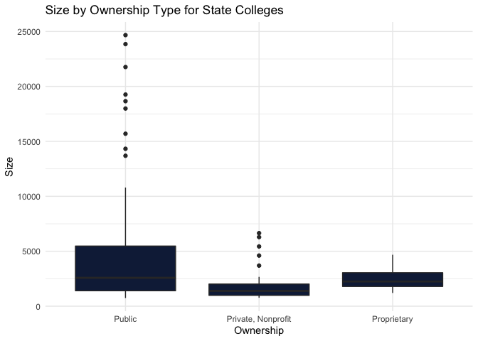<!-- -->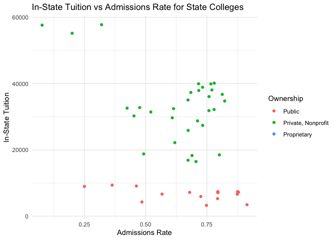<!-- -->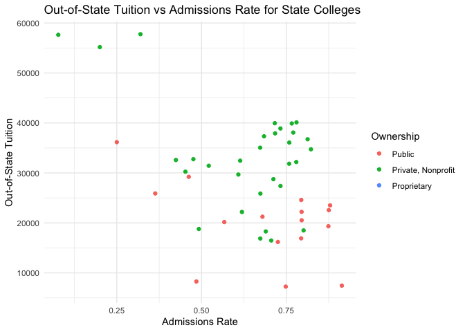<!-- -->

    ## # A tibble: 5 × 10
    ##   Name    Ownership  Admissions_Rate Test_Requiremen… SAT_Reading SAT_Writing SAT_Math ACT_English ACT_Writing ACT_Math
    ##   <chr>   <fct>                <dbl> <fct>                  <int>       <int>    <int>       <int>       <int>    <int>
    ## 1 Arizon… Proprieta…               1 Neither require…          NA          NA       NA          NA          NA       NA
    ## 2 Arizon… Proprieta…               1 Neither require…          NA          NA       NA          NA          NA       NA
    ## 3 Bais H… Private, …               1 Neither require…          NA          NA       NA          NA          NA       NA
    ## 4 Califo… Private, …               1 Recommended               NA          NA       NA          NA          NA       NA
    ## 5 Califo… Private, …               1 Neither require…          NA          NA       NA          NA          NA       NA
    ##                     
    ##                      Required Recommended Neither required nor recommended Do not know Considered but not required
    ##   Public                   13           6                                0           6                           0
    ##   Private, Nonprofit       22          11                               26           9                           0
    ##   Proprietary               0           4                                3           0                           0

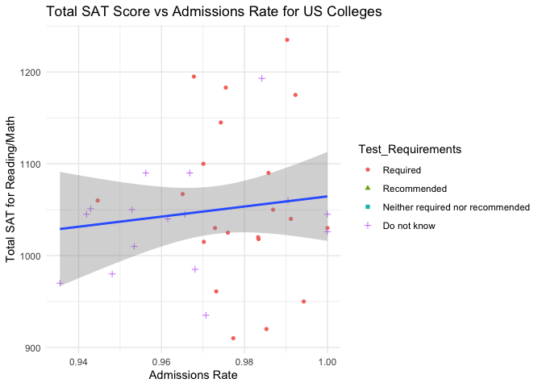<!-- -->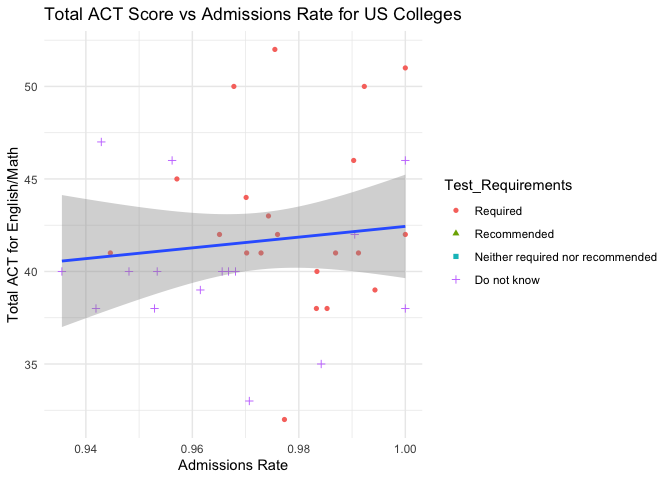<!-- -->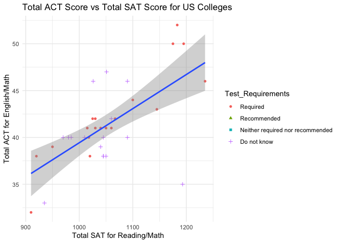<!-- -->

    ## # A tibble: 5 × 7
    ##   Name                   Ownership      In_State_Tuition Out_of_State_Tuit… Books_Supplies Room_Board_On Room_Board_Off
    ##   <chr>                  <fct>                     <int>              <int>          <int>         <int>          <int>
    ## 1 Wake Forest University Private, Nonp…            57760              57760           1500         15520          15520
    ## 2 Duke University        Private, Nonp…            57633              57633           1434         16026             NA
    ## 3 Davidson College       Private, Nonp…            55175              55175           1000         15225             NA
    ## 4 Guilford College       Private, Nonp…            40120              40120           1270         12400          12400
    ## 5 Meredith College       Private, Nonp…            39952              39952            850         11746          11746

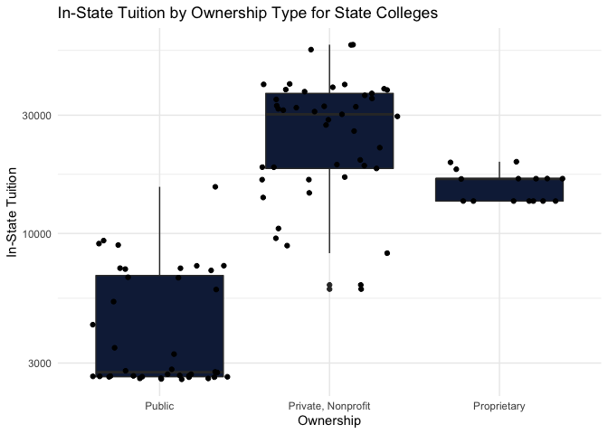<!-- -->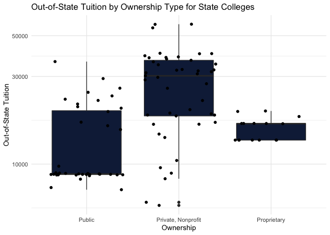<!-- -->

    ## # A tibble: 5 × 5
    ##   Name                         City  Ownership Ethnicity_Gender Count
    ##   <chr>                        <chr> <fct>     <chr>            <dbl>
    ## 1 Appalachian State University Boone Public    Total_Enrollment 17990
    ## 2 Appalachian State University Boone Public    Total_AIAN          25
    ## 3 Appalachian State University Boone Public    Total_NHPI           2
    ## 4 Appalachian State University Boone Public    Total_Asian        290
    ## 5 Appalachian State University Boone Public    Total_Black        639
    ## # A tibble: 16 × 3
    ## # Groups:   Ownership [2]
    ##    Ownership          Ethnicity_Gender Total_Count
    ##    <fct>              <chr>                  <dbl>
    ##  1 Public             Total_NHPI                36
    ##  2 Public             Total_Asian              727
    ##  3 Public             Total_Unknown           1222
    ##  4 Public             Total_AIAN              2091
    ##  5 Public             Total_Hispanic          5213
    ##  6 Public             Total_Black             8474
    ##  7 Public             Total_White            38479
    ##  8 Public             Total_Enrollment       59076
    ##  9 Private, Nonprofit Total_NHPI                20
    ## 10 Private, Nonprofit Total_AIAN                84
    ## 11 Private, Nonprofit Total_Asian              159
    ## 12 Private, Nonprofit Total_Hispanic           900
    ## 13 Private, Nonprofit Total_Unknown            988
    ## 14 Private, Nonprofit Total_Black             2981
    ## 15 Private, Nonprofit Total_White             6434
    ## 16 Private, Nonprofit Total_Enrollment       12365

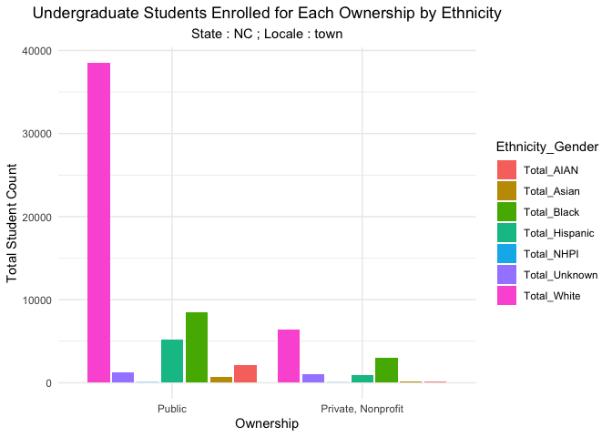<!-- -->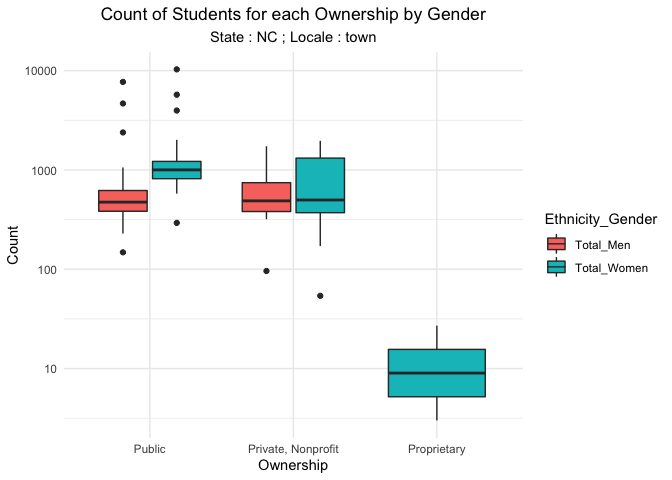<!-- -->

    ## # A tibble: 5 × 8
    ##   Name                      Ownership City      Size Poverty_Rate Median_Family_Inc… Female_Median_De… Male_Median_Debt
    ##   <chr>                     <fct>     <chr>    <int>        <dbl>              <int>             <int>            <int>
    ## 1 North Carolina State Uni… Public    Raleigh  24671         7.36              64900             17500            17555
    ## 2 University of North Caro… Public    Charlot… 23852         6.77              44089             17500            15902
    ## 3 East Carolina University  Public    Greenvi… 21766         9.40              51027             18750            17000
    ## 4 University of North Caro… Public    Chapel … 19261         7.01              58193             13000            13200
    ## 5 Wake Technical Community… Public    Raleigh  18658         6.64              24587              8276             6322

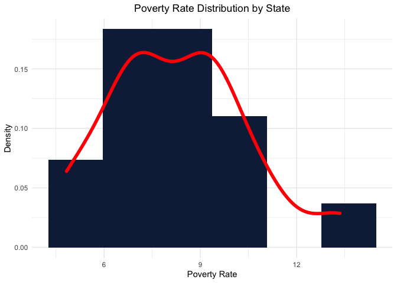<!-- -->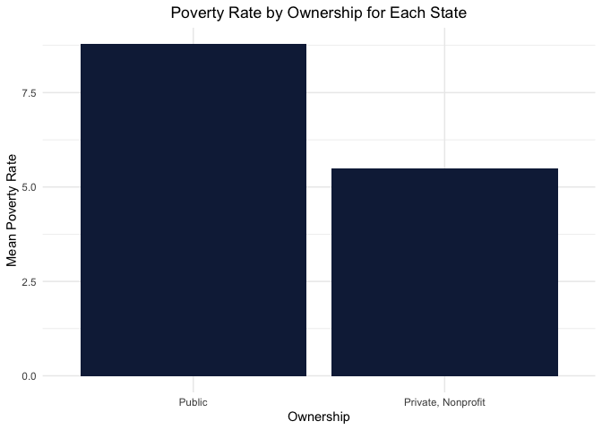<!-- -->

    ## # A tibble: 5 × 6
    ##   Name                              In_State_Tuition Out_of_State_Tuit… Median_Earnings Mean_For_Females Mean_For_Males
    ##   <chr>                                        <int>              <int>           <int>            <int>          <int>
    ## 1 Franklin W Olin College of Engin…            57356              57356          132969               NA             NA
    ## 2 Samuel Merritt University                       NA                 NA          123966           105400         138200
    ## 3 University of Health Sciences an…            30147              30147          121576           109300         112800
    ## 4 Albany College of Pharmacy and H…            36745              36745          119112           110100         119100
    ## 5 MCPHS University                             34650              34650          118171           102600         115500
    ## [1] 0.2187894

``` r
grid.arrange(instate_earning, outstate_earning, ncol=2)
```

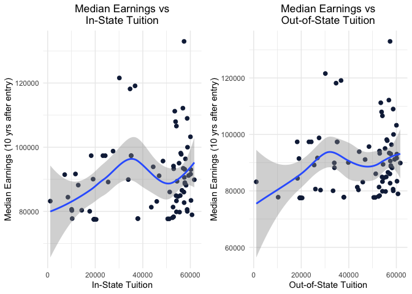<!-- -->

In the graphics created above, we start by exploring the general
information data. This dataset is a compilation of the tuition and
admission details for schools in a particular state. Since the general
data table consists of a substantial number of numeric columns, we draw
summary statistics for these numerical columns after first returning the
first five rows in the data frame. We then have a boxplot to see the
measure of spread of the number of students for the colleges in the
state separated by ownership. To understand whether there is a
correlation between tuition and the admission rate, we have a scatter
plot for both in-state and out-of-state tuition by admission rate coded
by ownership. It appears there is a weak negative correlation in both
instances, with it being slightly stronger between admission rates and
out-of-state tuition than between admission rates and in-state tuition.

We then analyze the admissions data consisting of the admissions rate
and test details for schools in a particular state. Again, we begin by
returning the first five rows of the data frame. Next, we visualize the
total SAT and total ACT scores vs admission rates coded by test
requirements to see if the total scores have a positive correlation with
admission rate for schools. This does not appear to be the case for
schools with high admission rates, but it would be interesting to see if
the same can be said for schools with low admission rates. We also
checked whether a higher ACT score is correlated with a higher SAT
score, which it clearly is. Majority of the Public schools Require a
Test Score for admission whereas majority of private schools neither
require nor recommend it.

We next move on to understand the cost perspective of these schools and
understand if the ownership of schools affects the different tuition
costs. We again print the first five rows of the data frame (and will
continue to do so for each of the six functions created) and also
explore the variability of in-state and out-of-state tuition costs by
ownership. It is clear from these box plots that both in-state and
out-of-state tuition are substantially lower for public schools than for
private schools. Although this is unsurprising for in-state tuition, the
large discrepency between median tuition rates for out-of-state public
schools and private schools was somewhat surprising to find.

Now that we have covered the different aspects of the schools, it would
be pertinent to see the student information in these schools. We start
by understanding the student diversity. We explore a school’s diversity
by understanding the number of students within each level of ethnicity
and gender. We group ethnicities by the school’s ownership and sum up
the total count to see the dominant ethnicity of students within each
ownership. It is not surprising to see that the most dominant ethnicity
is white across all ownerships. The next leading ethnicity is Hispanic.
We then see the total number of men and women in each ownership.
Private, Nonprofit schools have more variability and have more number of
women than men in NC. Though,Public schools in NC do not show anything
interesting in terms of gender, we see that a couple of schools have
outliers which needs to be inspected.

Moving next onto the financial backgrounds of students enrolled in these
schools, we explore the financial data. We plotted the distribution of
poverty rates for the particular state and investigate the mean poverty
rate of schools in each ownership. The poverty rate distribution seems
to show a bimodal distribution. We see that Public schools have higher
Mean Poverty Rate in comparison to Private Schools. This is an expected
observation since Private schools tend to have a higher tuition fees.

Finally, we desired to know the prospective outcome of the students
graduating from these schools to see how much they spent vs how much
they earned after graduating. For this, we have a scatter plot for the
median earnings of students plotted against tuition they would have paid
for that school. We see that the trend is not linear and that studying
from a school with higher tuition costs does not imply higher financial
prospects for the student in the future. To corroborate this finding, we
take the correlation of Tuition(In-state+Out-of-State) and Median
Earning 10 years after entry and the correlation coefficient is an
indication of little to almost no relationship between Tuition paid and
Median Earnings.
